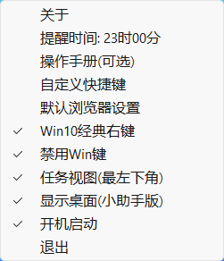
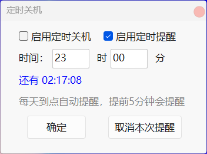
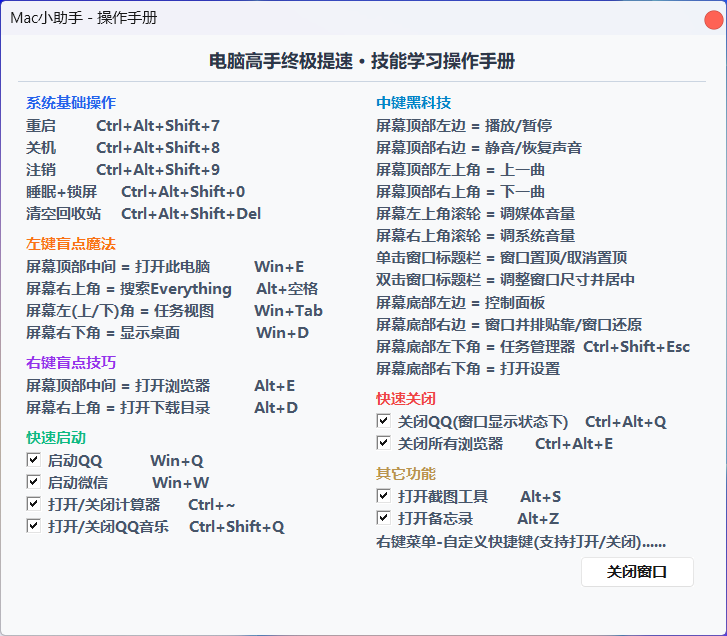
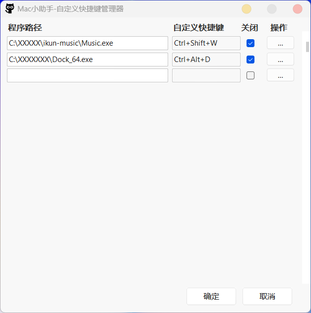

  

<h1 align="center">Win11小助手</h1>

  
  
  
  

把 Windows 变成你顺手的样子 —— 顶部热区一键操控、窗口智能管理、全局快捷键、截图备忘录、定时关机。

---

## ✨ 简介

**Win11小助手** 是一款常驻 Windows 的效率小工具，全方位简化电脑操作、提升使用效率。

- 轻量无广告，本地运行不联网
- 兼容 **Windows 7 / 10 / 11**（分版本提供）
- 即开即用，10 秒上手

## 🚀 核心功能

| 功能 | 说明 |
|------|------|
| 🖱️ 顶部热区三键联动 | 屏幕顶部左 / 右 / 中键分别绑定文件管理器、浏览器、全局搜索、媒体切歌、音量、任务管理器等 |
| 🪟 窗口智能管理 | 单击标题栏置顶 / 取消置顶；双击自动缩放居中；底部右侧窗口并排贴靠 / 还原 |
| ⌨️ 自定义全局快捷键 | 自由绑定任意程序到组合键，随时开关 |
| ⚡ 一键系统操作 | 关机 / 重启 / 锁屏 / 清空回收站 / 批量关软件 / 禁用 Win 键 |
| ✂️ 截图 & 备忘录 | Alt+S 快速截图，Alt+Z 随手记备忘录 |
| 🔧 默认浏览器 & 经典右键 | 一键切换默认浏览器，一键回归 Win10 经典右键菜单 |
| ⏰ 定时关机 / 提醒 | 两种互斥模式，到点自动提醒（提前 5 分钟） |
| 📘 内置操作手册 | 全功能快捷键一览表，随时可查 |

## 🖼️ 软件截图

  
  

  
  

## ⌨️ 常用快捷键

| 快捷键 | 功能 |
|--------|------|
| `Alt + S` | 打开截图 |
| `Alt + Z` | 打开 / 关闭备忘录 |
| `Ctrl+Alt+Shift+7` | 重启电脑 |
| `Ctrl+Alt+Shift+8` | 关机 |
| `Ctrl+Alt+Shift+9` | 注销 |
| `Ctrl+Alt+Shift+0` | 睡眠 + 锁屏 |
| `Ctrl+Alt+Shift+Del` | 清空回收站 |
| 单击标题栏 | 窗口置顶 / 取消置顶 |
| 双击标题栏 | 调整窗口尺寸并居中 |
| 屏幕底部右侧 | 窗口并排贴靠 / 还原 |
| `Win + Q` / `Win + W` | 启动 QQ / 微信（可配置） |
| `Ctrl+Shift+Q` | 关闭 QQ |
| `Ctrl+Alt+E` | 关闭所有浏览器 |

> 以上快捷键均可在「自定义快捷键管理器」中修改或开关。

## 📥 下载

| 版本 | 蓝奏云 | 百度网盘 |
|------|--------|----------|
| **Windows 10 / 11** | [蓝奏云下载](https://wouyou.lanzouv.com/i8Jjo3vtf1rc) | [百度网盘](https://pan.baidu.com/s/1wmUvZnb0HYodVsHLDvSdvA?pwd=vcg8) 提取码: `vcg8` |
| **Windows 7** | [蓝奏云下载](https://wouyou.lanzouv.com/iUzXs3vtf3ah) | [百度网盘](https://pan.baidu.com/s/1tyhUXjfoy8Zqqr7jUgDb-Q?pwd=4u4j) 提取码: `4u4j` |

也可在 [GitHub Releases](../../releases) 获取最新版。

## ⚠️ 关于杀毒软件误报

微软 Defender 等杀毒软件可能对**未签名**的本地程序产生误报，这是正常现象，**并非病毒**。
如遇误报，请在杀软中选择「**还原**」或「**添加信任**」即可正常使用。

## ❓ 常见问题

**Q：收费吗？**
A：当前版本完全免费，无广告、无内购。

**Q：支持哪些系统？**
A：提供 Win10/11 通用版与 Win7 专用版，下载时选对应版本即可。

**Q：会收集我的数据吗？**
A：本地运行、不联网上传，你的操作与内容都在自己电脑上。

**Q：快捷键和顶部热区能改吗？**
A：可以。全局快捷键在「自定义快捷键管理器」里自由绑定和开关；顶部热区功能可在设置中调整。

## 📝 更新日志

见 [Releases](../../releases) 页面，最新版 **V2.6.3.2**。

---

© 2026 Win11小助手 · 为更顺手的 Windows 而生

